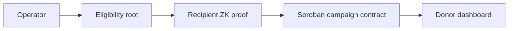
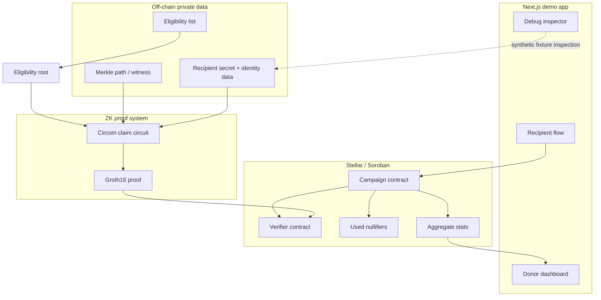

# Lumen

**Private, ZK-compliant aid disbursements on Stellar**

Lumen is a hackathon prototype for humanitarian aid campaigns where recipients can prove eligibility without publishing identity or eligibility data on a public payment rail. The project name is **Lumen**; package names use `lumen-aid` to avoid confusion with Stellar lumens/XLM.

## Project Name And Tagline

- Project name: **Lumen**
- Tagline: **Private, ZK-compliant aid disbursements on Stellar**

## Problem

Public blockchains make payments auditable, but that transparency can harm aid recipients. A public payment trail can reveal who received disaster relief, medical support, or household assistance, and can expose timing, location, eligibility reason, and social relationships.

Aid organizations need two things at the same time:

- recipient privacy, especially for vulnerable people,
- donor accountability, especially for campaign budgets and abuse prevention.

## Solution

Lumen separates private eligibility data from public campaign accounting.

Operators commit to an eligibility Merkle root and policy hash. Recipients generate a claim proof from their private secret, identity-derived data, and Merkle path. The public claim contains only campaign commitments, a nullifier, amount, and proof bytes. The campaign contract uses the nullifier to prevent duplicate claims and updates aggregate stats for donors.

Judges can demo:

- Alice: eligible recipient, accepted once.
- Alice again: duplicate nullifier blocked.
- Mallory: not in the eligibility tree, rejected.
- Donor dashboard: aggregate accountability without a recipient list.

## Why Stellar

Stellar is a strong fit for humanitarian payments because it provides:

- low-cost payment rails,
- stablecoin-oriented infrastructure,
- fast settlement for cross-border aid,
- Soroban smart contracts for transparent campaign state,
- an ecosystem already focused on real-world payments and financial access.

## How ZK Is Used

The ZK layer lets a recipient prove eligibility without revealing the private witness.

The real local proof path uses:

```txt
claim.circom
  -> Circom R1CS/WASM
  -> deterministic development Groth16 setup
  -> snarkjs witness generation
  -> snarkjs Groth16 proof
  -> snarkjs local verification
```

The Soroban verifier contract performs BN254 Groth16 verification by default for the current `claim_v0` development verification key. The browser demo still uses an explicit `dev_verifier` envelope through the local Soroban-shaped simulator; it is labeled as demo-only in the UI and docs.

## What The Proof Proves

The claim statement is:

> I know private recipient data that produces a leaf in this campaign's eligibility Merkle root. I derive the campaign-specific nullifier from my secret. My claim amount is within the campaign cap. I do not reveal my identity, eligibility reason, or Merkle path.

Circuit constraints:

```txt
leaf = Poseidon(recipient_secret, identity_hash, leaf_salt, policy_hash)
computed_root = MerkleRoot(leaf, eligibility_merkle_path, eligibility_merkle_indices)
computed_root == eligibility_root
nullifier_hash = Poseidon(recipient_secret, campaign_id)
amount <= max_amount
amount_commitment = Poseidon(amount, amount_salt, campaign_id)
recipient_commitment = Poseidon(recipient_secret, policy_hash)
```

## Public Vs Private

| Data | Visibility | Purpose |
| --- | --- | --- |
| recipient secret | Private | Recipient-owned secret used for leaf, nullifier, and recipient commitment |
| identity data / identity hash | Private | KYC or eligibility-derived value |
| Merkle path and indices | Private | Membership witness for the eligibility root |
| salts | Private | Blind leaf and amount commitment derivations |
| eligibility reason | Private demo metadata | Human-readable reason; not sent to contract |
| campaign ID | Public | Campaign domain separator |
| eligibility root | Public | Operator commitment to eligible set |
| policy hash | Public | Operator commitment to campaign rules |
| nullifier hash | Public | Double-claim prevention |
| amount | Public in this MVP | Simple campaign accounting and token transfer amount |
| max amount | Public | Campaign cap checked by proof and contract |
| amount commitment | Public | Future-compatible commitment for confidential amounts |
| recipient commitment | Public | Recipient commitment without identity disclosure |
| proof | Public bytes | Groth16 proof in real local/testnet paths; dev envelope in browser simulator |

## Architecture



System view:



## Tech Stack

- Stellar testnet and Soroban contracts.
- Rust 2021 with `soroban-sdk 27.0.0-rc.1`.
- Circom claim circuit, `pragma circom 2.1.6`.
- Project setup installs pinned Circom compiler tag `v2.2.3` into `.tools/circom/`.
- `snarkjs 0.7.6` for Groth16 proof generation and local verification.
- `circomlib 2.0.5` Poseidon and comparator circuits.
- TypeScript `5.8.3`.
- Next.js `16.2.9`, React `19.2.7`, Tailwind CSS `4.3.2`.
- `poseidon-lite 0.3.0` for TypeScript Merkle/nullifier helpers.
- Vitest for TypeScript tests.
- pnpm `11.7.0`.

## Contracts

| Contract | Path | Purpose |
| --- | --- | --- |
| Campaign | `contracts/campaign` | Stores campaign config, validates claim rules, calls verifier, stores nullifiers, updates aggregate stats |
| Verifier | `contracts/verifier` | Verifies `claim_v0` Groth16 proofs by default; has an explicit `dev_verifier` feature for tests only |
| Mock token | `contracts/mock_token` | Minimal demo token helper for local/testnet flows |

The campaign contract rejects inactive campaigns, wrong roots, wrong policy hashes, over-cap claims, exhausted budgets, duplicate nullifiers, and verifier failures. A nullifier is stored only after verifier success.

## Circuit

The circuit lives at:

```txt
circuits/claim/claim.circom
```

It models:

- eligibility leaf derivation,
- Merkle root recomputation,
- campaign-specific nullifier,
- public amount cap check,
- amount commitment,
- recipient commitment.

The public signal order is:

```txt
campaign_id
eligibility_root
policy_hash
nullifier_hash
amount
max_amount
amount_commitment
recipient_commitment
```

## Commands To Run

Install and run the web demo:

```bash
pnpm install
pnpm dev
```

Open:

```txt
http://localhost:3000
```

Reproduce the ZK path:

```bash
pnpm zk:doctor
pnpm zk:setup
pnpm zk:clean
pnpm zk:build
pnpm zk:prove:demo
pnpm zk:verify:local
```

Run the deterministic CLI demo:

```bash
pnpm demo:e2e
```

Run tests and builds:

```bash
pnpm test
pnpm contracts:test
pnpm build
```

Testnet commands, with a funded Stellar CLI key configured:

```bash
pnpm stellar:doctor
pnpm contracts:build
pnpm stellar:deploy:testnet
pnpm stellar:init-campaign:testnet
pnpm stellar:claim:alice:testnet
pnpm stellar:claim:alice-duplicate:testnet
```

## Demo Scenarios

1. Landing page: explain privacy problem, aggregate accountability, Stellar/Soroban architecture.
2. Recipient page: select Alice, generate proof, show local demo verification, submit claim, see accepted result.
3. Recipient page: try Alice again, see duplicate nullifier blocked.
4. Recipient page: select Mallory, generate proof, see rejection.
5. Donor page: show total budget, distributed amount, remaining amount, successful claims, duplicate claims blocked, invalid claims blocked, privacy status, verifier status.
6. Debug page: inspect synthetic private witness with the warning: "Demo debug mode. Do not use with real recipient data."

## Testnet Deployment

Current public Stellar testnet IDs are recorded in `deployments/` and documented in `docs/TESTNET_DEPLOYMENT.md`.

```txt
verifier   = CCHDSG4NLE4IWNGXOR46OYQRAW7KA4VQQB7NF4BTRH3D4HJIRBDLRR7D
campaign   = CCICXWSMCEY47JF2OWQ3OQMZEHVC5URNCWELWHQ2YRJEI2ETWKUAXCWI
mock token = CDCH6ECKA3EHYT7KO3ZXE275W2YCO7PAHRX4G2KGXNIZLFID5HFAFFC7
```

Status:

- Contracts are deployed and initialized on testnet.
- Alice testnet claim smoke test is accepted.
- Alice duplicate smoke test is rejected with `DuplicateNullifier #10`.
- Browser-submitted testnet claims are not wired yet; the browser demo uses the local simulator/dev envelope.

## Verifier Status

Use these exact labels when presenting the project:

- **Real local ZK proof**: Circom/snarkjs Groth16 proof generation and local verification.
- **Real on-chain verification**: Soroban BN254 Groth16 verifier in local contract tests and deployed testnet smoke path.
- **Dev-only on-chain verifier**: explicit dev verifier envelope/feature used by the browser simulator and dev tests. This is not production ZK.

See `docs/VERIFIER_STATUS.md` for the full truth table.

## Limitations

- The project is not audited.
- The current trusted setup artifacts are deterministic development artifacts, not a production ceremony.
- The browser demo uses a local simulator/dev verifier envelope.
- Browser-submitted testnet claims are not wired.
- Amounts are public in the MVP.
- Demo recipients are deterministic fixtures.
- Deny-list non-membership is not enforced yet.
- Network metadata, wallet metadata, and off-chain operational privacy are not solved.

See `docs/LIMITATIONS.md`.

## Future Work

- Production trusted setup and verifier key pipeline.
- Browser worker proving with artifact caching.
- Direct browser testnet submission.
- Confidential amounts.
- Auditor view keys and reporting exports.
- NGO/KYC provider integrations.
- Deny-list non-membership proofs.
- Wallet support and production security audits.

See `docs/ROADMAP.md`.

## Repository Structure

```txt
apps/web              Next.js demo UI
contracts/campaign    Soroban campaign contract
contracts/verifier    Soroban Groth16 verifier plus explicit dev feature
contracts/mock_token  Demo token helper
circuits/claim        Circom claim circuit and ZK scripts
packages/shared       Domain types and deterministic fixtures
packages/merkle       Poseidon leaves, Merkle tree, nullifiers, commitments
packages/prover       Dev envelope adapter and local witness checks
packages/stellar      Local/testnet campaign client helpers
scripts               E2E, ZK, and Stellar scripts
docs                  Submission, architecture, demo, limitations, roadmap
deployments           Public testnet deployment metadata
```
