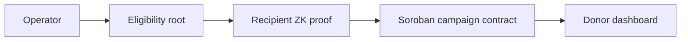
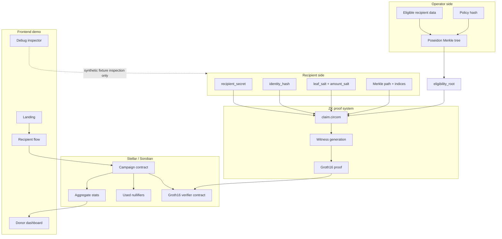
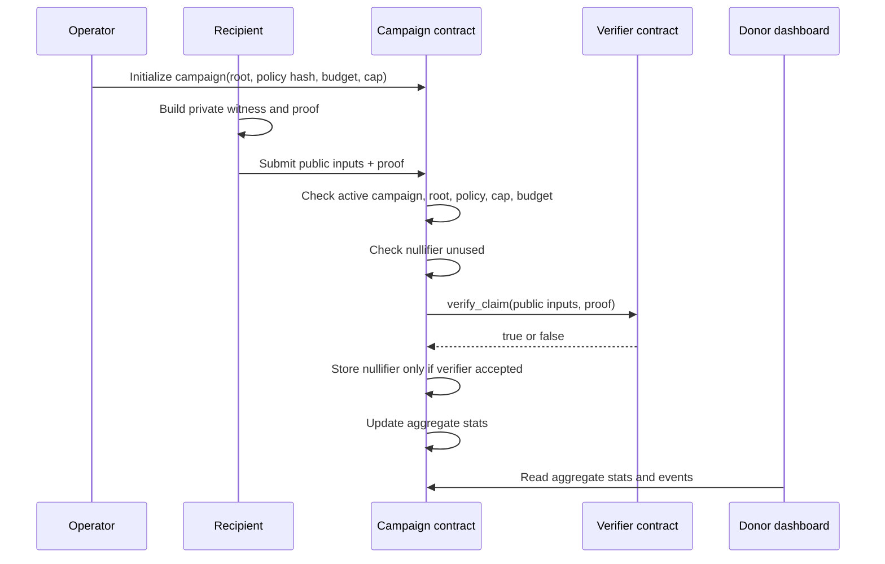

# Architecture

Lumen separates private eligibility evidence from public campaign accounting.

## Judge-level flow



In one sentence:

> The operator commits to who is eligible, the recipient proves eligibility privately, the Soroban campaign contract enforces claim rules, and donors see aggregate accountability.

## System components



## Public and private boundaries

Private, not submitted publicly:

- recipient secret,
- identity data / identity hash,
- Merkle path,
- Merkle path indices,
- salts,
- witness,
- human-readable eligibility reason in demo fixtures.

Public, sent to contract or used as public verifier signals:

- campaign ID,
- eligibility root,
- policy hash,
- nullifier hash,
- amount,
- max amount,
- amount commitment,
- recipient commitment,
- proof bytes.

The MVP amount is public for simple campaign accounting. The amount commitment is already modeled for a future confidential-amount path.

## Claim proof statement

The proof establishes:

```txt
leaf = Poseidon(recipient_secret, identity_hash, leaf_salt, policy_hash)
computed_root = MerkleRoot(leaf, eligibility_merkle_path, eligibility_merkle_indices)
computed_root == eligibility_root
nullifier_hash = Poseidon(recipient_secret, campaign_id)
amount <= max_amount
amount_commitment = Poseidon(amount, amount_salt, campaign_id)
recipient_commitment = Poseidon(recipient_secret, policy_hash)
```

The proof does not reveal recipient identity, eligibility reason, or Merkle path.

## Claim lifecycle



## Packages

- `apps/web`: Next.js App Router frontend demo.
- `packages/shared`: canonical TypeScript types and deterministic demo fixtures.
- `packages/merkle`: Poseidon leaves, Merkle tree construction, local proof helpers, nullifiers, and commitments.
- `packages/prover`: explicit dev-only browser proof envelope and local witness checks.
- `packages/stellar`: local/testnet campaign client helpers shaped around Soroban claim calls.
- `circuits/claim`: Circom claim circuit and ZK scripts.
- `contracts/campaign`: Soroban campaign state machine.
- `contracts/verifier`: Soroban Groth16 verifier and explicit dev feature.
- `contracts/mock_token`: minimal demo token helper.
- `scripts`: deterministic demo, ZK, contract build, and Stellar testnet scripts.

## Contracts

### Campaign contract

Path:

```txt
contracts/campaign
```

The campaign contract stores campaign config:

- campaign ID,
- operator,
- asset,
- budget,
- per-recipient cap,
- eligibility root,
- deny root,
- policy hash,
- verifier address,
- ledger window,
- active status.

It also stores aggregate stats:

- total claimed,
- claim count,
- remaining budget,
- duplicate claims blocked,
- invalid claims blocked.

Claim order:

1. Reject inactive or out-of-window campaigns.
2. Reject wrong eligibility root.
3. Reject wrong policy hash.
4. Reject wrong max amount.
5. Reject amount over cap.
6. Reject insufficient remaining budget.
7. Reject reused nullifier.
8. Call verifier contract.
9. Reject verifier failures.
10. Store nullifier.
11. Update aggregate stats and events.

The nullifier is never stored before verifier success.

### Verifier contract

Path:

```txt
contracts/verifier
```

Default behavior:

- real BN254 Groth16 verification for `claim_v0`,
- embedded deterministic development verification key,
- proof format `A(G1 64 bytes) || B(G2 128 bytes) || C(G1 64 bytes)`,
- rejects malformed proofs and public input mismatches.

Dev behavior:

- enabled only by explicit `dev_verifier` feature,
- accepts deterministic test-only proof bytes,
- not cryptographic proof verification,
- not used by default `pnpm contracts:test` or `pnpm contracts:build`.

## Verifier modes

| Mode | Status | Where used |
| --- | --- | --- |
| Real local ZK proof | Real | `pnpm zk:prove:demo`, `pnpm zk:verify:local` |
| Real on-chain verification | Real for current development key | `pnpm contracts:test`, deployed testnet smoke path |
| Dev-only on-chain verifier | Demo/test only | Browser simulator, explicit `dev_verifier` feature, `pnpm zk:build:dev` |

See `docs/VERIFIER_STATUS.md` for the canonical truth table.

## Testnet architecture status

Current public testnet contracts:

```txt
verifier   = CCHDSG4NLE4IWNGXOR46OYQRAW7KA4VQQB7NF4BTRH3D4HJIRBDLRR7D
campaign   = CCICXWSMCEY47JF2OWQ3OQMZEHVC5URNCWELWHQ2YRJEI2ETWKUAXCWI
mock token = CDCH6ECKA3EHYT7KO3ZXE275W2YCO7PAHRX4G2KGXNIZLFID5HFAFFC7
```

Working:

- contracts deployed,
- deterministic campaign initialized,
- Alice testnet claim smoke accepted,
- Alice duplicate testnet smoke rejected.

Not wired yet:

- browser-submitted testnet claims,
- production trusted setup,
- audited deployment.
